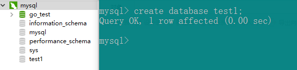
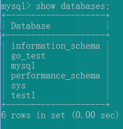

###sql语句
1. `DDL`  数据定义语句（定义数据库、表、列...） 例：create、drop、alter...
2. `DML`  数据操作语句（增、删、改、查表） 例：insert、delete、update、select...
3. `DCL`  数据控制语句（定义数据库、表、字段等的访问权限和安全级别） 例：grant、revoke...
4. `information_schema`：数据库主要存储一些数据库对象信息（用户表信息，权限信息）
5. `cluster`：存储了系统的集群信息
6. `mysql`：存储了系统的用户权限信息
7. `test`：系统自动创建的测试数据哭，任何用户都可以使用

1. 创建数据库 `create database dbname`
2. 查看数据库 `show databases`
3. 选择要操作的数据库 `use dbname`
4. 查看数据库中的表结构 `show tables`
5. 删除数据库 `drop database dbname`

####创建表

1. 创建表 `create table tablename(column_name column_type constraints ....)`;
例：`create table emp(ename varchar(10), hiredate date, sal decimal(10, 2), deptno int(2))`;
2. 修改表名 `alter table tablename rename new_tablename`
例：`alter table emp rename emp1`
2. 查看表 `desc tablename`;
3. 查看创建表的SQL语句 `show create table tablename \G`;
4. 删除表 `drop table emp`;
5. 修改表 `alter table tablename modify column_name column_type constraints ....`;
例：`alter table emp modify ename varchar(20)`
6. 增加表字段 `alter table tablename add column_name column_type constraints ....`;
例：`alter table emp add column age int(3)`
7. 删除表字段 `alter table tablename drop column_name`;
例：`alter table emp drop column age`
8. 修改表字段名 `alter table tablename add old_column_name column_name column_type`;
例：`alter table emp change age age1 int(4)`;

####DDL语句

1. 插入记录 `insert into tablename (field1, field2...) values (value1, value2...)`
例：`insert into emp (ename, hiredate, sal, deptno) values ('zzxl', '2000-01-01', '2000', 1)`
2. 插入多条记录 `insert into tablename (field1, field2...) values (value1, value2...),(value1, value2...)...`
例：`insert into emp (ename, hiredate, sal, deptno) values ('zzxl', '2000-01-01', '2000', 1),('zzxl', '2000-01-01', '2000', 1),('zzxl', '2000-01-01', '2000', 1)`
3. 更新记录 `update tablename set field1=value1,field2=value2... where condition`
例: `update emp set sal=4000 where ename = 'lisa'`
4. 删除记录 `delete from tablename where condition`
例：`delete from emp where ename = 'dony'`
5. 查询记录 `select * from tablename where condition`
例：`select * from emp`   查询所有
例：`select ename from emp`     查询ename字段
例：`select distinct ename from emp`  查询不重复字段
例：`select * from emp where ename = 'zzx'`  条件查询
例：`select * from emp where ename = 'zzx' and sal < 3000`  多条件查询
例：`select * from emp order by sal`  查询并按照sal字段排序
例：`select * from emp order by sal limit 3`  查询并按照sal字段排序的前3条数据
例：`select * from emp order by sal limit 3`  查询并按照sal字段排序的前3条数据
6. 表连接 `select field, ... from tablename, ... where tablename1.column = tablename2.column`
例： `select ename, deptname from emp, dept where emp.deptno=dept.deptno`
